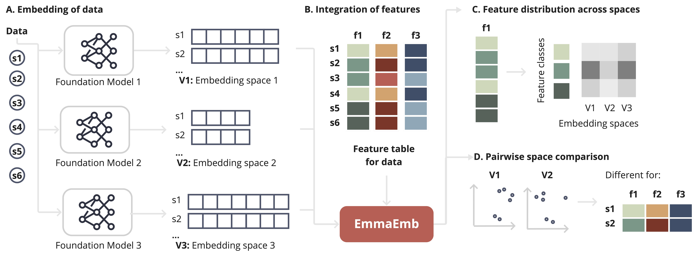

# EmmaEmb

EmmaEmb is a Python library designed to facilitate the initial **comparison** of diverse **embedding spaces** in embeddings for  molecular biology. By incorporating **user-defined feature data** on the natural grouping of data points, EmmaEmb enables users to compare global statistics and understand the differences in clustering of natural groupings across different embedding spaces.

Although designed for the application on embeddings of molecular biology data (e.g. protein sequences), the library is general and can be applied to any type of embedding space.

## Overview

- **[Features](#features)**
- **[Installation](#installation)**
- **[Colab Notebook Examples](#colab-notebook-examples)**
- **[Scripts for Protein Language Model Embeddings](#scripts-for-protein-language-model-embeddings)**
- **[License](#license)**

## Features

The following figure provides an overview of the ema-tool workflow:



EmmaEmb is centered around the `Emma` object, which serves as the core of the library. This object is initialized with feature data and provides the following functionality:

1. **Loading Embedding Spaces**: Embedding spaces can be added incrementally to the Emma object. Importantly, these spaces:
    - Need to be precomputed (scripts for generating embeddings from protein language models are [provided](#scripts-for-protein-language-model-embeddings)).
    - Do not need to have the same number of dimensions.
    - Are automatically stored within the Emma object for subsequent analyses.

2. **Computation of Pairwise Distances**: EmmaEmb calculates pairwise distances between samples in each embedding space. This enables the comparison across spaces. Users can select from multiple distance metrics, including:
    - Euclidean
    - Cosine
    - Manhattan

3. Analysis
-  **Feature distribution across spaces**: Analyze how specific features are represented across embedding spaces.
    - **KNN feature alignment scores**: Quantify the alignment of features by examining the nearest neighbors of each sample in different spaces. This score reveals the extent to which similar samples in one space are also similar in another.
    - **KNN class similarity matrix**: Measure the consistency of class-level relationships by assessing the overlap of nearest neighbors for samples within the same class across spaces. This provides insights into class-level embedding fidelity.

- **Pairwise space comparison**: Directly compare embedding spaces to identify global and local differences.
    - **Global comparison of pairwise distances**: Pairwise distances are calculated between all samples within each embedding space. This enables a global comparison of distance distributions across spaces to understand geometric alignment.
    - **Cross-space neighborhood similarity**: Determine how neighborhoods of samples overlap between embedding spaces. This metric is key to assessing local structural preservation.

- **Dimensionality Reduction**: EmmaEmb supports dimensionality reduction techniques such as PCA, t-SNE, and UMAP to visualize and analyze high-dimensional embeddings in lower-dimensional spaces. These visualizations are critical for intuitive understanding of embedding space structure.


The following figure provides an overview of the ema-tool workflow:


## Installation

You can install the ema library through pip, or access examples locally by cloning the github repo.

### Installing the ema library
```
pip install ema-emb
```

### Cloning the ema repo
```
git clone https://github.com/broadinstitute/EmmaEmb

cd ema                         # enter project directory
pip3 install .                 # install dependencies
jupyter lab colab_notebooks    # open notebook examples in jupyter for local exploration
```

### Getting Started

To get started with the EmmaEmb library, load the metadata and embeddings, and initialize the `Emma` object. The following code snippet demonstrates how to use the ema-tool to compare two embedding spaces:

```python
from emmaemb import Emma
from emmaemb.vizualization import *

# Initialize Emma object with feature data
emma = Emma(feature_data=feature_data)

# Add embedding spaces
emma.add_embedding_space("ProtT5", "embeddings/prot_t5_embeddings")
emma.add_embedding_space("ESM2", "embeddings/esm2_embeddings")

# Compute pairwise distances
emma.calculate_pairwise_distances("ProtT5", "cosine")
emma.calculate_pairwise_distances("ESM2", "cosine")

# Plot space after dimensionality reduction
fig_1 = plot_emb_space(
    emma, emb_space="ProtT5", color_by="enzyme_class", method="PCA"
)

# Analyze global comparison of pairwise distances
fig_2 = plot_pairwise_distance_comparison(
    emma, emb_space_x="ProtT5", emb_space_y="ESM2", metric="cosine", group_by="species"
)

# Analyze feature distribution across spaces
fig_3 = plot_knn_alignment_across_embedding_spaces(
    emma, feature="enzyme_class", k=10, metric="cosine"
)
```


## Colab Notebook Example

Two examples of how to use the ema-tool library is provided in the following colab notebooks: 

| Link | Description |
|---------|-------------|
[](https://colab.research.google.com/github/pia-francesca/ema/blob/main/colab_notebooks/application_example_ion_channel_proteins.ipynb) | Example of how to use the ema-tool to compare protein embeddings across three ESM models
[](https://colab.research.google.com/github/pia-francesca/ema/blob/main/colab_notebooks/application_example_HCN1_variants.ipynb) | Example of how to use the ema-tool to compare embeddings of missense mutations across two ESM models


## Scripts for Protein Language Model Embeddings

The repository also contains a wrapper [script](plm_embeddings/get_embeddings.py) for retrieving protein embeddings from a diverse set of pre-trained Protein Language Models. 

The script includes a heuristic to chunk and aggregate long sequences to ensure compatibility with the models' input size constraints.

The script supports the following models:

- [Ankh](https://github.com/agemagician/Ankh)
- [ProtT5](https://github.com/agemagician/ProtTrans)
-  [ProstT5](https://github.com/mheinzinger/ProstT5)
- [ESM1 and ESM2](https://github.com/facebookresearch/esm)
- [ESM3 and ESMC](https://github.com/evolutionaryscale/esm)


## Contact 

If you have any questions or suggestions, please feel free to reach out to the authors: francesca.risom@hpi.de.

More information about the library can be found in our pre-print on bioRxiv: [ema-tool: a Python Library for the Comparative Analysis of Embeddings from Biomedical Foundation Models](https://www.biorxiv.org/content/10.1101/2024.06.21.600139v1).

## License
This project is licensed under the MIT License - see the [LICENSE](LICENSE) file for details.

